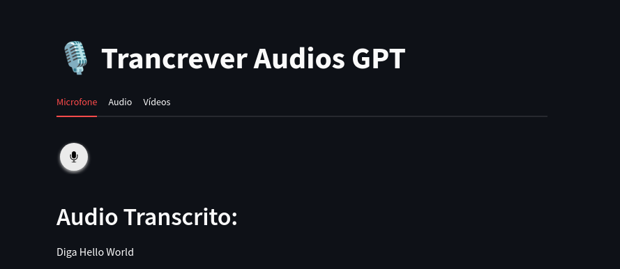
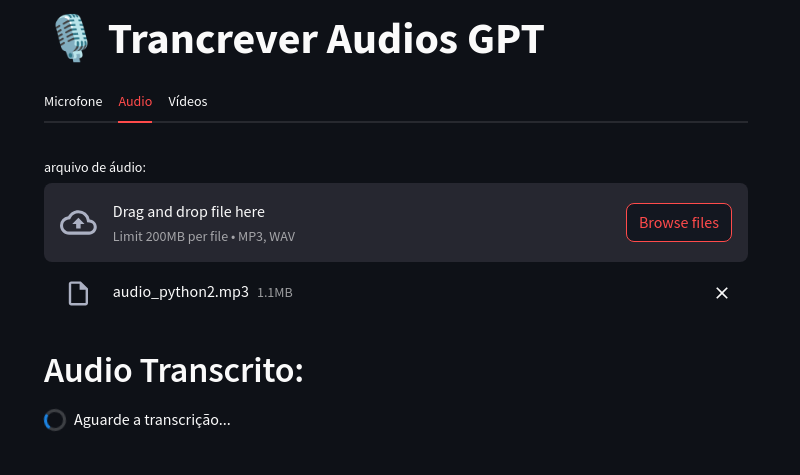
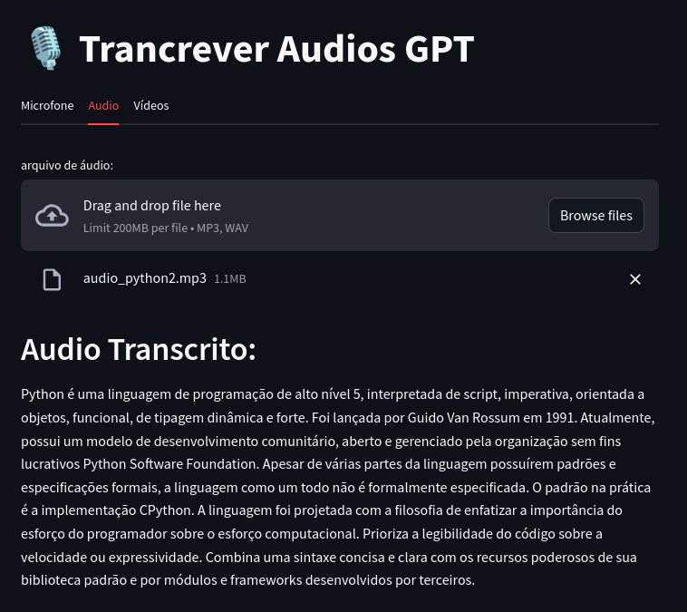
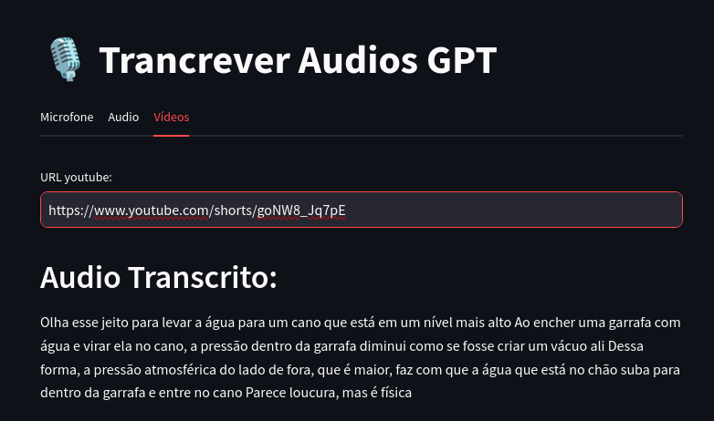

# Trancrição de audios usando API do Chat GPT:

## Instruções:

### Instale o ffmpeg:
Linux:
```bash
sudo apt-get install ffmpeg libavcodec-extra
```
Windows:

1. Download and extract libav from Windows binaries provided here.
2. Add the libav /bin folder to your PATH envvar
3. pip install pydub

### Instale as bibliotecas:

```bash
pip install -r requirements.txt
```

### Executando o aplicativo:

```bash
streamlit run home.py
```

## Imagens:

1. Transcrição pelo Microfone:<br>


2. Transcrição de audio (esperando transcrição):<br>


3. Transcrição de audio (Transcrita):<br>


4. Transcrição de video do youtube:<br>
